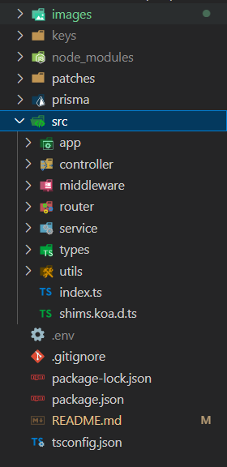

## koa-ts-template

general 分支集成了常用的注册用户 登录功能

- 登录使用的是 jwt token 使用的是 openSSL 公私钥加密的方式 生成方式[见此](https://www.fzb.me/2015-1-15-openssl-rsa.html)
- test.controller.ts 是对 token 的校验测试，使用在具体项目时可以删除

### 目录结构



- images readme 文件中存放图片
- keys 公私钥存放处
- patches 修改 node_modules 的记录文件
- prisma 数据库映射文件
- src 资源目录
  - app 全局配置

### 使用

- 根目录添加.env 文件 设置 DATABASE_URL 参考[prisma 文档](https://www.prisma.io/docs/getting-started/setup-prisma/start-from-scratch/relational-databases/connect-your-database-typescript-postgres).
- .env 文件 添加 APP_HOST APP_PORT 设置 host 和项目启动端口
- 根目录创建 keys 文件夹在该文件夹下使用 openSSL 生成公私钥对
- 安装依赖

  ```
  npm run install
  ```

- 将 model 映射到数据库

  ```
  npm run db
  ```

- 开启应用

  ```
  npm run start
  ```

### 注意

1. 每次手动修改 model 后需要重新生成 prisma client api，即手动执行

```
 npm run db
```

如果执行完后仍然 ts 没有正确的代码提示，关掉项目重新启动即可

2. 在定义 koa-bodyparser 库的 body 类型遇到了类型定义的问题，采用了修改 node-modules 中@types/koa-bodyparser 中 index.d.ts 的类型并用 patch-package 这个第三方库保证使用本模板安装环境时也修改这个类型文件。具体使用时采用类型断言的方式绕开 ts 检测。


```ts
const { username, password } = ctx.request.body as IUserInfo;
```

实现方式不够优雅，如果有更好的方式欢迎 PR
