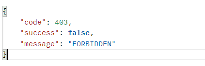
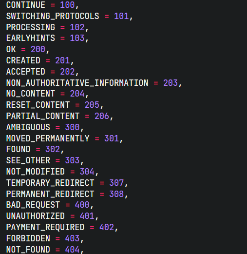

## koa-ts-template

这是一个通用的 koa typescript 配置环境，支持的功能如下

- 集成 [prisma](https://www.prisma.io/) 对 ts 类型支持友好的数据库 ORM 支持 MYSQL/PostgreSQL/SQLite/MongoDB 等
- 封装了数据返回规范和错误处理函数
  

  

```ts
//  错误处理
ctx.onError({
  code: HttpStatus.FORBIDDEN,
});
//  成功数据返回
ctx.onSuccess({
  data: res,
  code: HttpStatus.OK,
});
```

- 封装通用的路由中间件注册方案解放双手不用手动注册路由
