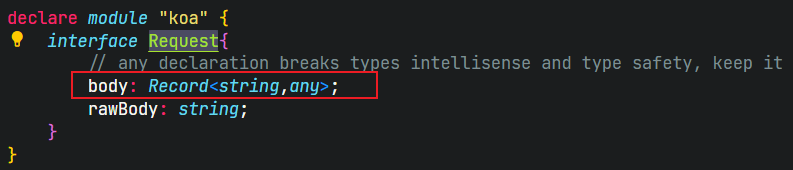
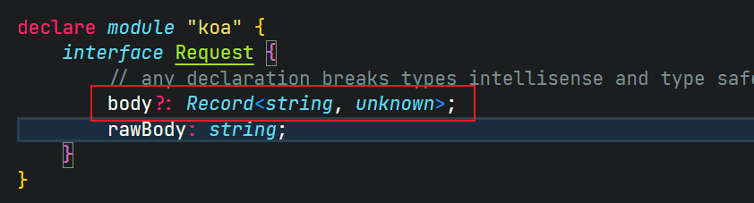

## koa-ts-template

general 分支集成了常用的注册用户 登录功能

### 使用

- 登录使用的是 jwt token 使用的是 openSSL 公私钥加密的方式 生成方式[见此](https://www.fzb.me/2015-1-15-openssl-rsa.html)
- test.controller.ts 是对 token 的校验测试，使用在具体项目时可以删除

### 注意

1. 每次手动修改 model 后需要重新生成 prisma client api，即手动执行

```
 npm run db
```

如果执行完后仍然 ts 没有正确的代码提示，关掉项目重新启动即可

2. 在定义 koa-bodyparser 库的 body 类型遇到了类型定义的问题，采用了修改 node-modules 中@types/koa-bodyparser 中 index.d.ts 的类型并用 patch-package 这个第三方库保证使用本模板安装环境时也修改这个类型文件。具体使用时采用类型断言的方式绕开 ts 检测。




```ts
const { username, password } = ctx.request.body as IUserInfo;
```

实现方式不够优雅，如果有更好的方式欢迎 PR
